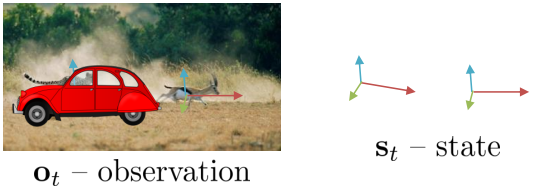
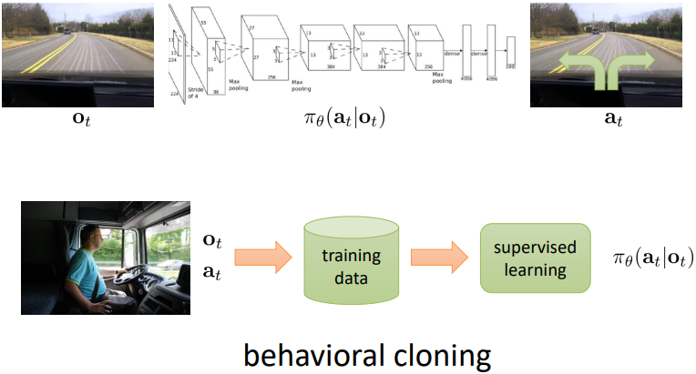
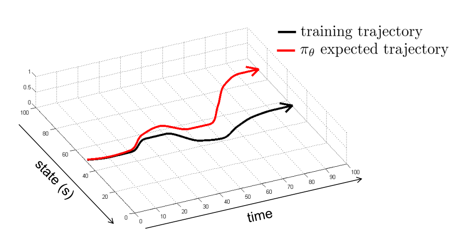
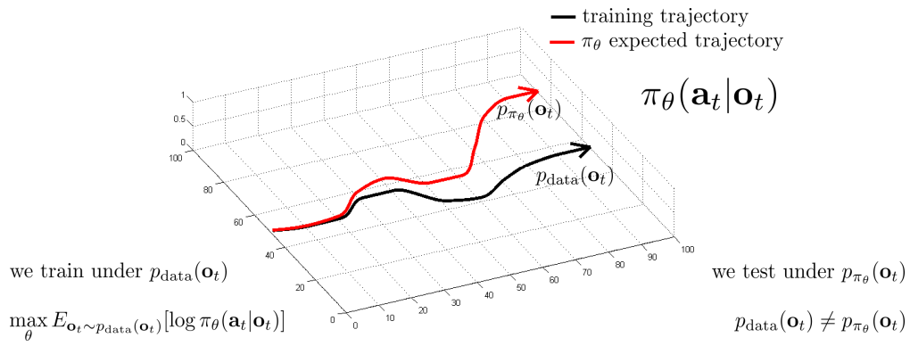
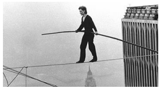
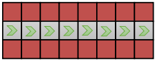
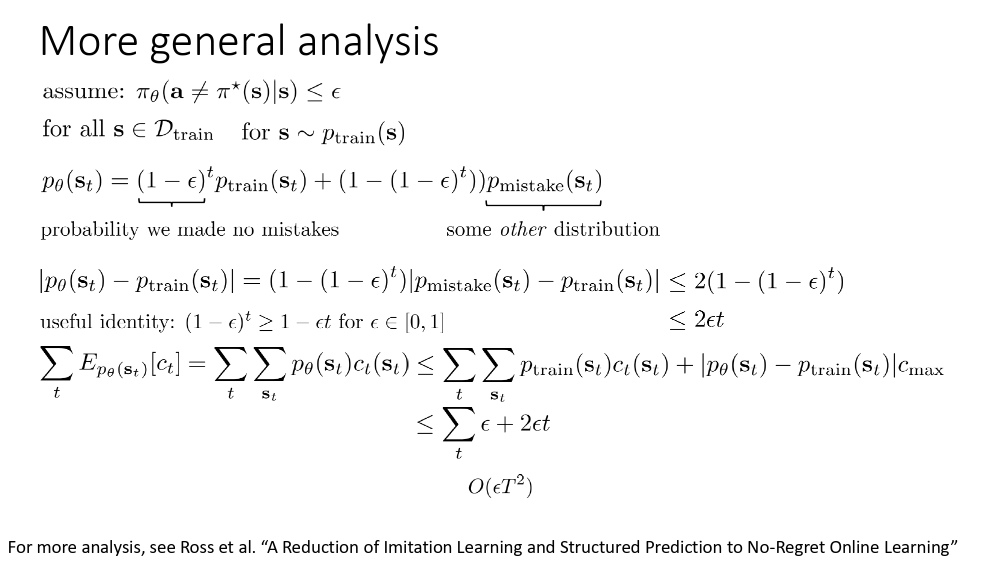
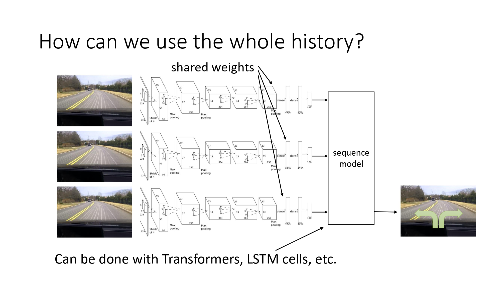
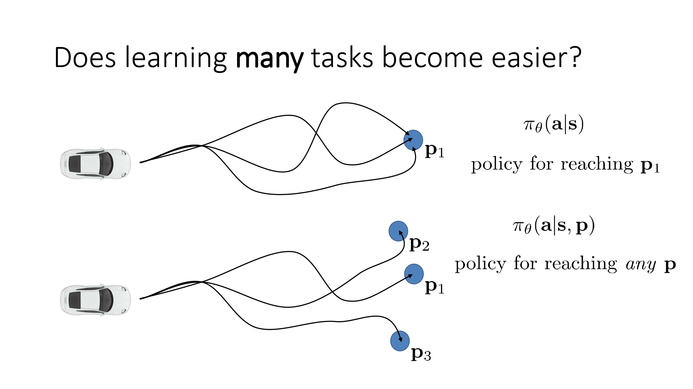
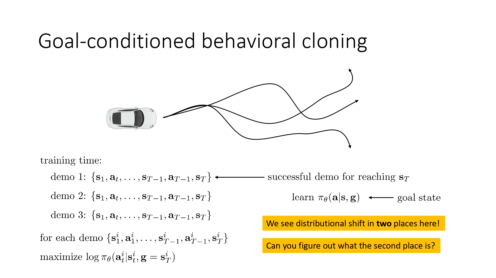

+++
date = '2025-02-05T01:10:35+09:00'
draft = false
title = 'Lecture 2, Imitation Learning'

tags = ["Deep Reinforcement Learning"]
description = "UC Berkeley의 CS 285 강의인 Deep Reinforcement Learning의 Lecture 2 정리"

UseHugoToc = true
showtoc = true
tocopen = false

[cover]
image = "images/cover.webp"  # 같은 폴더 내 이미지 사용
relative = true  # when using page bundles set this to true, 페이지 번들 내부 이미지 사용
+++

> 강의 자료: [UC Berkeley - Deep Reinforcement Learning](https://rail.eecs.berkeley.edu/deeprlcourse/) 강의 영상: [Youtube Link](https://www.youtube.com/playlist?list=PL_iWQOsE6TfVYGEGiAOMaOzzv41Jfm_Ps)
> 

- Terminology & notation
    - $\mathbf{s}_t$: state
    - $\mathbf{o}_t$: observation
    - $\mathbf{a}_t$: action
    - $\pi_\theta(\mathbf{a}_t \mid \mathbf{o}_t)$: policy
    - $\pi_\theta(\mathbf{a}_t \mid \mathbf{s}_t)$: policy (fully observed)
    
    - $s_t$와 $o_t$는 별개이다. 단, Imitation Learning에서는 대부분 같다.
    - $o_t$에서 $s_t$를 완전히 추론하지 못하는 경우도 있다. 예를 들어, 아래 이미지에서 치타를 추론하고자 한다. 자동차에 가려져 있어 치타를 추론하지 못할 수 있다.
        
        
        
    - 반면, $s_t$에서 $o_t$로는 항상 계산 가능하다.

- Markov property
    - 미래는 현재에 따라 결정된다. 과거와 무관하다.

- 강화 학습에서의 표기법과 로봇&제어에서의 표기법
    
    |  | 강화 학습 | 로봇&제어 |
    | --- | --- | --- |
    | state | $\mathbf{s}_t$ | $\mathbf{x}_t$ |
    | action | $\mathbf{a}_t$ | $\mathbf{u}_t$ |
    | 학자 | Richard Bellman(동적 프로그래밍(Dynamic Programming) 개발자) | Lev Pontryagin(최적 제어 이론(Optimal Control Theory)의 선구자) |

- Behavioral cloning이 잘 안 되는 이유
    - 근본적인 이유는 [i.i.d. property](https://son-dongwoo.github.io/posts/lecture-1/) 때문이다.
    - 학습 시 $\mathbf{o}_t$에서의 라벨링은 $\mathbf{o}_{t+1}$에 영향을 미치지 않는다. 그러나 현실에서는 과거의 선택이 미래의 Observation에 영향을 미치기 때문에 결과적으로 제대로 동작하지 않는다.
    
    
    
    Images: Bojarski et al. ‘16, NVIDIA
    
    
    
    state를 1차원으로 표현할 수 없지만 직관적인 설명을 위해 가정하였다.

- Behavioral cloning이 잘 안 되는 이유의 이론적 배경
    - The distributional shift problem
        - train dataset의 확률 분포와 최종 정책 확률 분포의 차이로 인해 제대로 동작하지 않는다.
    
    
    
    - 수학적 분석을 위해 몇 가지 가정을 한다.
        1. 학습된 정책 확률 분포의 좋고 나쁨을 판단하기 위해 cost function(reward function)을 정의한다.
            
            $$ 
            c(\mathbf{s}_t,\mathbf{a}_t) = 
            \begin{cases} 
            0 & \text{if } \mathbf{a}_t = \pi^*(\mathbf{s}), \\[1mm]
            1 & \text{otherwise}
            \end{cases}
            $$
            
            
($\pi^*(\mathbf{s})$은 운전자의 행동이 최적이라고 가정)  
            
        2. 학습의 목적을 cost function의 최소화로 설정한다.
            
            $$
            \text{Goal: minimize } \mathbb{E}_{\mathbf{s}_t \sim p_{\pi_\theta}(\mathbf{s}_t)} \bigl[ c(\mathbf{s}_t, \mathbf{a}_t) \bigr]
            $$
            
        3. 작은 실수 확률 $\epsilon$ 정의: train data set에 등장하는 상태 $\mathbf{s}$에서는 운전자의 행동 $\pi^*(\mathbf{s})$와 다른 행동을 할 확률이 $\epsilon$ 이하라고 가정한다. $\epsilon$은 작지만 0이 아닌 확률이기에 ‘실수가 발생할 수 있음’을 의미한다.
            
            $$
            \text{assume}: \quad \pi_\theta\bigl(\mathbf{a} \neq \pi^*(\mathbf{s}) \mid \mathbf{s}\bigr) \leq \epsilon \quad \text{for all } \mathbf{s} \in \mathcal{D}_{\text{train}}
            $$
        
    - $T$에 대한 cost 계산
        
        $$
        E\Bigl[\sum_t c(\mathbf{s}_t, \mathbf{a}_t)\Bigr] \leq \epsilon T + (1 - \epsilon)\Bigl(\epsilon (T - 1) + (1- \epsilon)(\ldots)\Bigr)
        $$

        $$
        → O(\epsilon T^2)
        $$

<aside style="border-radius: var(--radius); background:var(--code-bg); padding:5px 10px; margin-bottom:10px; border-left:5px solid #f1c40f;">
💡계산 방식

1. 첫 스템에서 실수할 확률은 $\epsilon$ 이다. 이후 나머지 스템 $T - 1$ 전체가 실수한다고 생각하면, 기여 비용(Contribution to cost)는 $\epsilon \times T$ 이다.
2. 첫 스텝에 실수가 없을 확률은 $(1 - \epsilon)$이다. 두 번째 스텝에서 실수할 확률은 $\epsilon$ 이다. 두 번째 스텝부터 실수한다고 생각하면, $T - 1$ 스텝 동안 실수하는 것이다. 이때 기여 비용은 $(1 - \epsilon)\epsilon \ \times \ (T - 1) \approx \epsilon T$ 
3. 즉, 전체 $T$에 대한 cost를 계산하면 $O(\epsilon T^2)$임을 알 수 있다. 
</aside>

- $O(\epsilon T^2)$에 대한 의미
    - 작은 실수 확률 $\epsilon$이 존재해도 $T$가 길어지면, 최대 $O(\epsilon T^2)$이라는 큰 누적 cost가 발생할 수 있다.

- 극단적인 예시
    - 극단적인 예시로 외줄 타기를 들 수 있다.
    - 외줄 타기에서 한 번만 실수해도 바닥으로 떨어진다. 즉, 실수 한 번 이후 상태는 전부 ‘학습이 안 되어 있는 상태’가 된다. 남은 시간 동안 실수가 누적될 수 있다.

    
    

- 확률 분포 관점에서의 분석
    - $(1 - \epsilon)^t$: 한 번도 실수하지 않을 확률
    - $p_{mistake}(\mathbf{s}_t)$: 조금이라도 실수를 한 뒤에 가게 되는 분포 (train data set에서 벗어난 상태)

- [Total Variation Distance(TV Norm)](https://blog.naver.com/ycpiglet/223087981574)를 활용한 수식 변형
    - TV Norm은 두 분포가 얼마나 차이나는가를 판단한다. Norm이 0에 가까워지면 두 분포가 근사적으로 일치함을 의미한다.
    - 학습된 분포와 train data set 사이의 차이를 확인한다.
    
    $$ 
    \begin{aligned}
    \left| p_\theta(\mathbf{s}_t) - p_{\text{train}}(\mathbf{s}_t) \right| 
    &= \Bigl|(1 - \epsilon)^t \, p_{\text{train}}(\mathbf{s}_t) + \Bigl(1 - (1 - \epsilon)^t\Bigr) \, p_{\text{mistake}}(\mathbf{s}_t) - p_{\text{train}}(\mathbf{s}_t)\Bigr| \\
    &= \Bigl| -\Bigl(1 - (1 - \epsilon)^t\Bigr) \, p_{\text{train}}(\mathbf{s}_t) + \Bigl(1 - (1 - \epsilon)^t\Bigr) \, p_{\text{mistake}}(\mathbf{s}_t) \Bigr| \\
    &= \Bigl|(1 - (1 - \epsilon)^t) \Bigl(p_{\text{mistake}}(\mathbf{s}_t) - p_{\text{train}}(\mathbf{s}_t)\Bigr)\Bigr| \\
    &= (1 - (1 - \epsilon)^t) \left| p_{\text{mistake}}(\mathbf{s}_t) - p_{\text{train}}(\mathbf{s}_t) \right|
    \end{aligned}
    $$
        
    - $(1 - \epsilon)^t \geq 1 - \epsilon t$ for $\epsilon \in [0, 1]$를 활용하여 
      
      $$ 
      \begin{aligned}
      (1-\epsilon)^t &\geq 1 - \epsilon t, \\
      \Rightarrow\; 1 - (1-\epsilon)^t &\leq \epsilon t, \\
      \therefore\quad 1-(1-\epsilon)^t &\approx \epsilon t.
      \end{aligned}
      $$
        
    - 즉, 아래와 같이 TV Norm을 정리할 수 있다.
      
      $$ 
      \begin{aligned}
      \left| p_\theta(\mathbf{s}_t) - p_{\text{train}}(\mathbf{s}_t) \right| 
      &= \Bigl(1 - (1 - \epsilon)^t\Bigr) \left| p_{\text{mistake}}(\mathbf{s}_t) - p_{\text{train}}(\mathbf{s}_t) \right| \\
      &\leq 2\Bigl(1 - (1-\epsilon)^t\Bigr) \\
      &\leq 2 \epsilon t.
      \end{aligned}
      $$
        
    - 2배인 직관적인 이유  
      (생략)
        
    - 시간 축에 대하여 cost를 모두 합산했을 때,
      
      $$ 
      \begin{aligned}
      \sum_t \epsilon + 2 \epsilon t 
      &= \epsilon \sum_{t=1}^{T} t + 2 \epsilon t \\
      &= \epsilon \frac{T(T+2)}{2} + 2 \epsilon t \\
      &= \epsilon\Bigl(\frac{T(T+2)}{2} + 2t\Bigr) \\
      &\text{if $T$가 아주 크다면,} \\
      &\approx O(\epsilon T^2)
      \end{aligned}
      $$
        
- 결론
    - $T$가 커질 수록 $\epsilon$이 작아도 누적 cost가 엄청 커진다.
    - Behavior cloning을 사용했을 때, train에서 벗어난 상황이 발생하면 대응하지 못하는 경우가 발생할 수 있음을 강조한다.

- Imitation Learning은 train data에 적당한 실수와 오류가 있어야 더 잘 동작한다.

- behavior cloning을 활용한 Imitation learning을 잘 동작하게 하는 방법
    1. collect and augment
        - 의도적으로 실수(mistakes)와 수정 사항(corrections)을 추가한다.
            - 실수를 학습을 방해하지만 수정 사항은 도와준다. 그러나 수정 사항은 종종 실수 보다 크게 방해할 수 있다.
        - 데이터 증강(data augmentation)
        - Case Study
            1. trail following as classification - GIUSTI, Alessandro, et al. A machine learning approach to visual perception of forest trails for mobile robots. *IEEE Robotics and Automation Letters*, 2015, 1.2: 661-667.
            2. imitation with a cheap robot - RAHMATIZADEH, Rouhollah, et al. Vision-based multi-task manipulation for inexpensive robots using end-to-end learning from demonstration. In: *2018 IEEE international conference on robotics and automation (ICRA)*. IEEE, 2018. p. 3758-3765.
    2. 강력한 모델 사용하기
        - Non-Markovian behavior
            - sequence model을 활용하여 전체 기록을 학습한다.
            
            
            
        - Multimodeal behavior
            1. expressive continuous distribution을 사용한다.
                1. mixture of Gaussians
                    1. 장점: 구현하기 쉬움
                    2. 단점: weight를 지정해야 함.
                2. latent variable models
                    1. 해당 분야에서 널리 사용되는 variational sutoencoder 모델 사용하기
                3. diffusion models
            2. 고차원 액션 스페이스를 이산화한다. 
                1. 이산화의 문제: 1차원은 쉬우나 고차원은 어렵다.
                2. 해결 방안: 한 번에 한 차원씩 이산화하기
                    1. Autoregressive discretization
                        1. sequence model block을 활용하여 이산화하기
                            1. 장점: 복잡한 분포를 얻을 수 있다.
                            2. 단점: 시퀀스 모델을 사용하여 무겁다.
            3. Study Case
                1. imitation with diffustion models - CHI, Cheng, et al. Diffusion policy: Visuomotor policy learning via action diffusion. *The International Journal of Robotics Research*, 2023, 02783649241273668.
                2. imitation with latent variables - ZHAO, Tony Z., et al. Learning fine-grained bimanual manipulation with low-cost hardware. *arXiv preprint arXiv:2304.13705*, 2023.
                3. imitation with transformers - BROHAN, Anthony, et al. Rt-1: Robotics transformer for real-world control at scale. *arXiv preprint arXiv:2212.06817*, 2022.
        - Multi-task learning
            
            
            
            
            
            - 어떻게 두 번째 장소에 도착한 것을 알 수 있을까? 아직은 잘 모르겠지만 상당히 신기한 부분이다.
            - Study Case
                - YU, Tianhe, et al. Unsupervised visuomotor control through distributional planning networks. *arXiv preprint arXiv:1902.05542*, 2019.
                - GHOSH, Dibya, et al. Learning to reach goals via iterated supervised learning. *arXiv preprint arXiv:1912.06088*, 2019.
                - ANDRYCHOWICZ, Marcin, et al. **Hindsight experience replay**. *Advances in neural information processing systems*, 2017, 30.